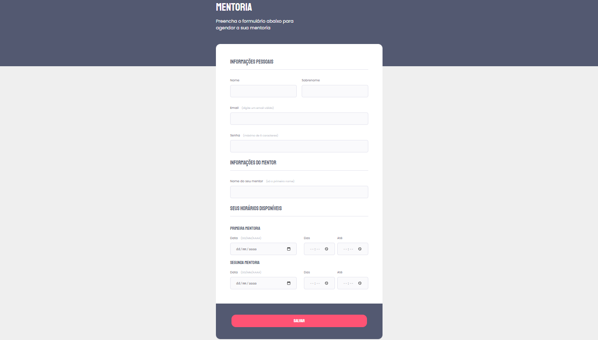

# 🚀 Trilha Explorer

> Formulário intermediário, aplicação do 0 a partir de um layout no figma!

[🔗Clique para acessar](https://rodkunz.github.io/form-intermediary/)

## 🛠 Tecnologias utilizadas

- HTML
- CSS
- Git e Github

## 💻 Contato

raokrodrigo@gmail.com